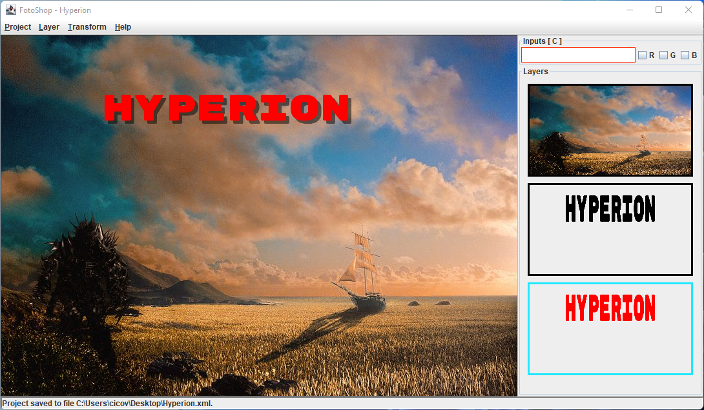

# FotoShop - Simple desktop image editor

## Features

- Create, load and save image editing projects.
- Load multiple images as layers of the final product.
- Stack, move, hide, and delete layers.
- Change layer transparency.
- Transform pixels by applying many predefined operations on the whole layer,
    or on individual color components.
- Transform layers by applying predefines filters, like negative and grayscale.
- Save the resulting product as an image file.

## Example

